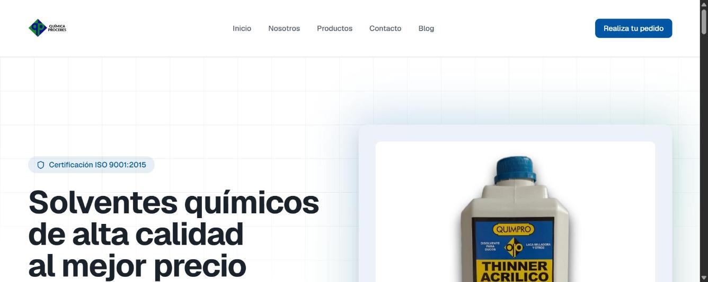

# QUIMPRO WebPage

Sitio web oficial de QUIMPRO, empresa quimica peruana lider en la fabricacion y comercializacion de solventes industriales de alta calidad.

**Demo en produccion:** https://www.quimicaproceres.com/ (49 commits)

## Captura

## Sobre el proyecto

QUIMPRO es una empresa quimica peruana con mas de 20 anos de experiencia (desde 2002), especializada en la fabricacion, comercializacion y distribucion de solventes quimicos de alta calidad para los sectores industrial, automotriz y comercial. Este sitio es su vitrina oficial: catalogo de productos, seccion corporativa con descarga de documentos, formulario de contacto para pedidos mayoristas, y diseno responsivo con soporte de tema claro/oscuro.

## Stack tecnico

**Frontend:** Next.js 16 (SSR), TypeScript, Tailwind CSS, Radix UI, Lucide React. **Backend:** Prisma ORM, Next.js API Routes. **Despliegue:** Vercel.

## Funcionalidades

Catalogo de productos (thinner, alcohol isopropilico, solventes especializados); seccion Quienes somos con descarga de PDFs (alcance de la empresa, politica de calidad); formulario de contacto para solicitudes mayoristas; diseno responsivo y accesible (HTML5 semantico, navegacion por teclado); certificacion ISO 9001:2015 destacada.

## Estado

Proyecto en produccion activa, con 49 commits y 4 branches: el mas maduro del portafolio.

---

Desarrollado por Richard Esteban
